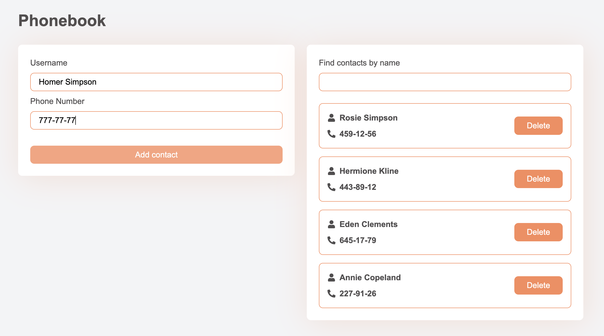

# GOIT - React: Image Searching App

## Module 4: HTTP Requests

This repository contained the implementation of an image search application using React. The project was created with Vite, used Formik for forms, Axios for HTTP requests, and styled components with CSS modules. The application had several key functionalities, which are summarized below:

## Functionality Summary

- **Image Search**:

  - Implemented a search bar for keyword-based image search.
  - Displayed a gallery of images based on search results.
  - Included pagination to load more images.

- **Component Structure**:

  - Each component was organized in its own folder within `src/components`.
  - Default exports were used for all components.

- **Axios for HTTP Requests**:

  - Used Axios to perform HTTP requests to the Unsplash API.
  - Retrieved images and other relevant information from the API.

- **Initial Setup**:

  - Registered for an Unsplash developer account to obtain the access key.
  - Configured the application to use the Unsplash API for image searches.

- **SearchBar Component**:

  - Created a form with an input field for searching images.
  - Displayed notifications using React Hot Toast if the search input was empty.

- **ImageGallery Component**:

  - Rendered a list of image cards.
  - Only displayed when images were available.

- **ImageCard Component**:

  - Rendered individual images within the gallery.

- **Loader Component**:

  - Displayed a loading spinner while images were being fetched.

- **ErrorMessage Component**:

  - Displayed error messages when HTTP requests failed.

- **LoadMoreBtn Component**:

  - Rendered a button to load more images.
  - Only displayed when there were images to load.

- **ImageModal Component**:
  - Displayed a larger version of the image in a modal window.
  - Closed the modal on ESC key press or click outside the modal.

## Live Demo

- **Source Files**: [GitHub Repository](https://github.com/grifano/goit-react-hw-03.git)
- **Working Page**: [Live Preview](https://goit-react-hw-03-sooty-alpha.vercel.app/)

## Project Setup

1.  Clone the repository.
2.  Install dependencies: `npm install`
3.  Start the development server: `npm run dev`

## Code Quality

- Ensured no errors or warnings in the console.
- Maintained clean and understandable JavaScript code using Prettier for formatting.

## Component List

- `App`: The root component containing the main structure.
- `SearchBar`: Component with a form to search for images.
- `ImageGallery`: Component to display a list of image cards.
- `ImageCard`: Individual image item within the gallery.
- `Loader`: Loading spinner displayed during image fetch.
- `ErrorMessage`: Displayed when an error occurred during image fetch.
- `LoadMoreBtn`: Button to load more images.
- `ImageModal`: Modal window to display an enlarged version of the image.
