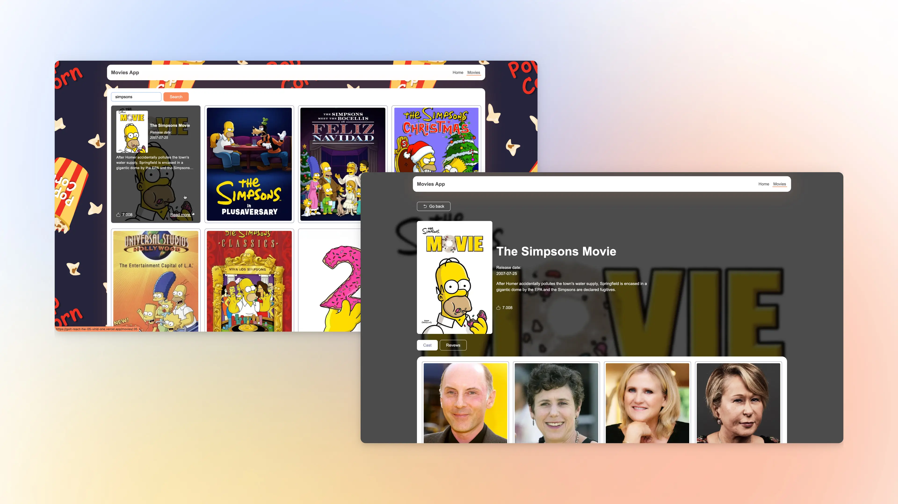

# React Movies App

## Module 5: Routing and Lazy load

This repository contained the implementation of a movie search application using React with routing. The project was created with Vite, utilized React Router for routing, Axios for HTTP requests, and styled components with CSS modules. The application had several key functionalities, which are summarized below:

## Functionality Summary

- **Movie Search**:

  - Implemented a search bar for keyword-based movie search.
  - Displayed a list of popular movies on the homepage.
  - Included detailed pages for movies, their cast, and reviews.

- **Component Structure**:

  - Each component was organized in its own folder within `src/components`.
  - Each page was organized in its own folder within `src/pages`.
  - Default exports were used for all components.

- **Axios for HTTP Requests**:

  - Used Axios to perform HTTP requests to the TMDB API.
  - Retrieved movies and other relevant information from the API.

- **Initial Setup**:

  - Registered for a TMDB developer account to obtain the access key.
  - Configured the application to use the TMDB API for movie searches.

- **Navigation in the Application**:
  - Implemented several routes:
    - `'/'` for the homepage displaying trending movies.
    - `'/movies'` for the movies search page.
    - `'/movies/:movieId'` for movie details.
    - `'/movies/:movieId/cast'` for movie cast details.
    - `'/movies/:movieId/reviews'` for movie reviews.
    - A catch-all route for non-existent routes to display a not found page.

## Live Demo

- **Source Files**: [GitHub Repository](https://github.com/grifano/goit-react-hw-05.git)
- **Working Page**: [Live Preview](https://goit-react-hw-05-virid-one.vercel.app/)

## Project Setup

1. Clone the repository.
2. Install dependencies: `npm install`
3. Start the development server: `npm run dev`

## Code Quality

- Ensured no errors or warnings in the console.
- Maintained clean and understandable JavaScript code using Prettier for formatting.

## Component List

- `App`: The root component containing the main structure.
- `HomePage`: Displays a list of trending movies.
- `MoviesPage`: Allows users to search for movies by keyword.
- `MovieDetailsPage`: Displays detailed information about a movie.
- `MovieCast`: Displays the cast of a movie.
- `MovieReviews`: Displays reviews for a movie.
- `NotFoundPage`: Displays a message for non-existent routes.
- `Navigation`: Contains navigation links.
- `MovieList`: Displays a list of movies.

## Acknowledgments

[GOIT](https://edu.goit.global/uk/referral?x=eyJlbWFpbCI6InNvcmxlbmtAZ21haWwuY29tIiwiZmlyc3ROYW1lIjoi0KHQtdGA0LPRltC5IiwibG9jYWxlIjoidWsiLCJsYW5ndWFnZSI6InVrIiwidG90YWxIb3VycyI6NzcsImN1cnJlbnRPckxhc3RUZWNobm9sb2d5IjoiSFRNTF9DU1MiLCJwYXNzZWRIb21ld29ya3NDb3VudCI6NX0=) -
big love to GoIT team for their patience, afford, help, and positivity that they
share with us ❤️

## Author

- Website - [www.grifano.com](https://grifano.com)
- Frontend Mentor -
  [www.frontendmentor.com](https://www.frontendmentor.io/profile/grifano)
- LinkedIn - [www.linkedin.com](https://www.linkedin.com/in/grifano/)
